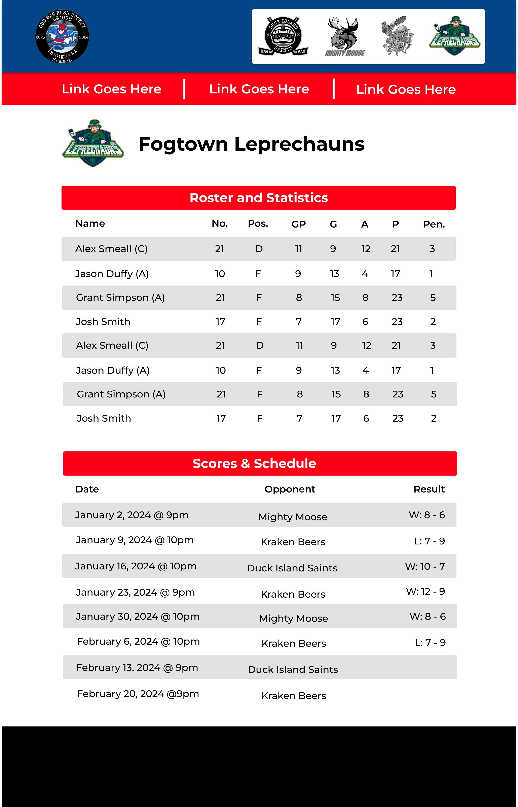

# Project Title

**The Official Website for the [Odd Man Rush Hockey League](https://www.facebook.com/profile.php?id=61550747964046)**

## Overview

I play in a recreational ice hockey league in St. John's, Newfoundland. As a new league (founded in 2023) it lacks some of the bells and whistles of some of the more established leagues in our city or anywhere else in the world for that matter. One of those things is its own official website. 

Furthermore, there may be an opportunity to expand this into a platform that services recreational sports league managers in a similar fashion to how Shopify helps small retailers implement an eCommerce store with minimal technical know-how. 

### Problem

Every major Canadian city (and many others globally) has dozens or even hundreds of recreational sports leagues. Many of these leagues are run off a combination of social media apps, messaging apps and spreadsheets to keep track of schedules, rosters, stats and league fees. This is confusing, inefficient, and does not present these leagues to the members in a professional manner. 

### User Profile

In most of these leagues, the people running them are doing so part-time on top of their full-time job and often it's in a volunteer capacity. These are usually not people with technical skills, and even if they do have them, they are not in a position to maintain a fully functional website. They need something plug and play to help organize their league while making it look organized and professional at the same time. 

### Features

- A homepage with some nice graphics and a synopsis of recent announcements. It should also be obvious how people can navigate to the schedules, standings, rosters and stats. 
- A schedule page that showcases upcoming games.
- A scores/results page that showcases recent games, the score, the results and links to their boxscores.
- A rosters page that shows off the roster of each team including names, positions, numbers and stats.
- A stats page that shows off the overall stats of the league including who is leading in certain categories.
- A standings page that shows off the record of each team and what position they are in.
- Certain logged in members will have the ability to add players to teams and add games results to populate the pages above. 

## Implementation

### Tech Stack

The plan is to build this with next.js using Firebase as the platform. This may or may not require a node.js server (still looking into that) and will leverage the Firebase NoSQL database to keep track of schedules, scores and stats. 

### APIs

May need to leverage Facebook and/or Instagram APIs to pull in posts from those. Otherwise, most data will be input by the people running the league. 

### Sitemap

- Homepage
- Standings Page
- Teams Page
- Roster for each team
- Stats page
- Stats for each team
- Schedule page
- Announcements page (may live on homepage)
- Backend login for league managers to enter data

### Mockups

**Homepage**

**Team Page**

### Data

- Every league will require a list of teams. Those teams will need details such as the name, captain, colour, etc.
- Every league will require a schedule that utilizes the list of teams to figure out who plays who. 
- That schedule will get turned into a score when game results are inputted. Those scores will then influence the standings table. 
- The standings table will track datapoints such as wins, losses, ties, goals scored and goals again for each team and need to be sortable. 
- Each team will then need a stats table that tracks player names, numbers, etc but also summarizes their stats from each game result such as goals, assists, penalties, etc. 

### Endpoints

In progress. Will add soon. 

### Auth

Yes, will implement via firebase. Two permission levels:

- League managers who can do almost anything
- Team captains who can add players and edit players within their own team

## Roadmap

1. Build out homepage layout with mock data
2. Build out team pages with static data
3. Build out schedule page with static data
4. Build out standings page with static data
5. Build out stats page with static data
6. Setup database to collect per game results
7. Configure database to dynamically populate the standings and stats pages

## Nice-to-haves

Initially this will focus on creating a website for my league specifically as proof of concept. Ideally, it will include the functionality so that someone who is non technical can load in game results and those will dynamically flow to the rest of the pages. If all goes very well, I can then start looking into if this has potential as a platform. 
